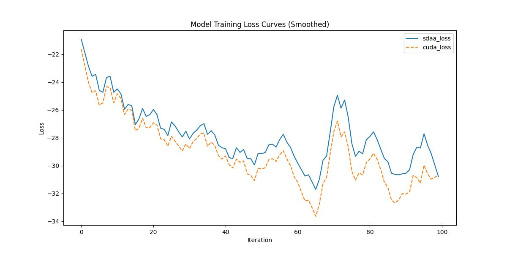

# NAFNet
## 1. 模型概述
NAFNet（Nonlinear Activation Free Network for Image Restoration）是MEGVII Research与清华大学团队开发的一个计算机视觉（CV）领域的Transformer模型。该模型的核心思想为提出非线性激活函数自由网络（Nonlinear Activation Free Network, NAFNet），通过简化网络结构（如移除传统ReLU/GELU激活）实现高效计算，同时保持高性能。适用于通用图像复原任务，包括去噪（Denoising）、去模糊（Deblurring）、超分辨率（Super-Resolution）等。
> **论文链接**：[Nonlinear Activation Free Network for Image Restoration](https://arxiv.org/abs/2204.04676)
> **仓库链接**：https://github.com/megvii-research/NAFNet 

## 2. 快速开始
使用本模型执行训练的主要流程如下：
1. 基础环境安装：介绍训练前需要完成的基础环境检查和安装。
2. 获取数据集：介绍如何获取训练所需的数据集。
3. 构建环境：介绍如何构建模型运行所需要的环境
4. 启动训练：介绍如何运行训练。

### 2.1 基础环境安装

请参考基础环境安装章节，完成训练前的基础环境检查和安装。

### 2.2 准备数据集
#### 2.2.1 获取数据集
> 下载训练集到指定文件夹：```/data/teco-data/SIDD/Data```。
> 训练集链接： [google drive](https://drive.google.com/file/d/1UHjWZzLPGweA9ZczmV8lFSRcIxqiOVJw/view?usp=sharing) | [百度网盘](https://pan.baidu.com/s/1EnBVjrfFBiXIRPBgjFrifg?pwd=sl6h)。

> 下载测试集(lmdb格式)到指定文件夹：```/data/teco-data/SIDD/val/```
> 测试集链接： [google drive](https://drive.google.com/file/d/1UHjWZzLPGweA9ZczmV8lFSRcIxqiOVJw/view?usp=sharing) | [百度网盘](https://pan.baidu.com/s/1EnBVjrfFBiXIRPBgjFrifg?pwd=sl6h)

#### 2.2.2 处理数据集
> 解压训练集：```unzip /data/teco-data/SIDD/Data/SIDD-train.zip -d ./data/teco-data/SIDD/Data``` 
> 裁剪并写出为lmdb格式（注意数据集的存放路径与代码中对齐）：```python scripts/data_preparation/sidd.py``` 
> 解压测试集：```unzip /data/teco-data/SIDD/val//SIDD-val.zip -d /data/teco-data/SIDD/``` 
> 解压后的文件结构应该为：```/data/teco-data/SIDD/val/input_crops.lmdb``` | ```/data/teco-data/SIDD/val/gt_crops.lmdb```


### 2.3 构建环境

所使用的环境下已经包含PyTorch框架虚拟环境
1. 执行以下命令，启动虚拟环境。
    ```
    conda activate torch_env
    ```
2. 安装python依赖
    ```
    cd <ModelZoo_path>/PyTorch/contrib/Super_resulotion/NAFNet_Denoise
	pip install -r requirements.txt
	python setup.py develop --no_cuda_ext
    ```
### 2.4 启动训练
1. 在构建好的环境中，进入训练脚本所在目录。
    ```
    cd <ModelZoo_path>/PyTorch/contrib/Super_resulotion/NAFNet_Denoise/run_scripts
    ```

2. 运行训练。该模型支持单机单卡。

    -  单机单卡
    ```
   python run_NAFNet.py --opt options/train/SIDD/NAFNet-width32.yml --launcher pytorch 2>&1 | tee sdaa.log
   ```
    更多训练参数参考[README](run_scripts/README.md)

### 2.5 训练结果
输出训练loss曲线及结果（参考使用[loss.py](./run_scripts/loss.py)）: 


MeanRelativeError: -0.040815997825516225
MeanAbsoluteError: 1.203839988708496
Rule,mean_relative_error -0.040815997825516225
pass mean_relative_error=-0.040815997825516225 <= 0.05 or mean_absolute_error=1.203839988708496 <= 0.0002
