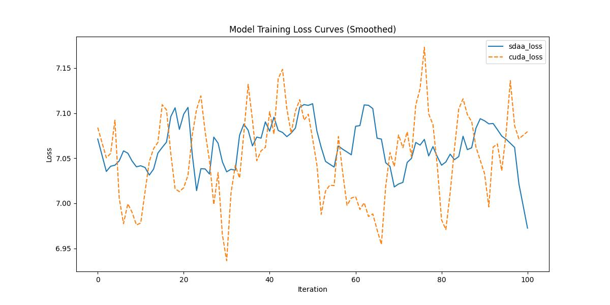

# **CoAtNet**
## 1. 模型概述  
CoAtNet 由 Google Research 的 Zihang Dai, Hanxiao Liu, Quoc V. Le, Mingxing Tan 等人于 2021 年提出，是一种将卷积神经网络 (CNN) 和 Transformer 自注意 (self-attention) 结合的“混合 (hybrid)”视觉模型。其设计目标是综合利用 CNN 的归纳偏置（inductive bias，帮助模型在数据较少时具有良好泛化）和 Transformer 的高容量 (capacity, 能力拟合复杂结构 / 大数据) —— 通过合理融合卷积 (convolution) 与注意力 (attention)，实现兼具数据效率与高表现力的视觉 backbone。
> **论文链接**：https://arxiv.org/abs/2106.04803
> **仓库链接**：https://github.com/huggingface/pytorch-image-models  

## 2. 快速开始  
使用本模型执行训练的主要流程如下：  
1. 基础环境安装：介绍训练前需要完成的基础环境检查和安装。  
2. 获取数据集：介绍如何获取训练所需的数据集。  
3. 构建环境：介绍如何构建模型运行所需要的环境。  
4. 启动训练：介绍如何运行训练。  

### 2.1 基础环境安装  

请参考基础环境安装章节，完成训练前的基础环境检查和安装。  

### 2.2 准备数据集  

### Step 1: Dataset Preparation

#### 2.2.1 获取数据集
ImageNet 数据集，该数据集为开源数据集，可从 [ImageNet](https://image-net.org/) 下载。

#### 2.2.2 处理数据集
具体配置方式可参考：https://blog.csdn.net/xzxg001/article/details/142465729。

### 2.3 构建环境

所使用的环境下已经包含PyTorch框架虚拟环境  
1. 执行以下命令，启动虚拟环境。  
    ```
    conda activate torch_env  
    ```
2. 安装python依赖  
    ```
    cd <ModelZoo_path>/PyTorch/contrib/pytorch_image_model/coatnet/
    pip install -r requirements.txt
    pip install -e .
    ```
### 2.4 启动训练  
1. 在构建好的环境中，进入训练脚本所在目录。  
    ```
    cd <ModelZoo_path>/PyTorch/contrib/pytorch_image_model/coatnet/run_scripts
    ```

2. 运行训练。该模型支持单机单卡。

    -  单机单卡
    ```
    python run_coatnet.py \
    --data-dir /data/teco-data/imagenet \
    --model coatnet_2_rw_224 \
    --sched cosine \
    --epochs 1 \
    --warmup-epochs 5 \
    --lr 0.4 \
    --reprob 0.5 \
    --remode pixel \
    --batch-size 16 \
    --amp \
    -j 4 \
    --log-interval 1 \
    2>&1 | tee sdaa.log
   ```
    更多训练参数参考[README](run_scripts/README.md)

### 2.5 训练结果
输出训练loss曲线及结果（参考使用[loss.py](./run_scripts/loss.py)）: 


MeanRelativeError: 0.0019055584086841645
MeanAbsoluteError: 0.011185924605567856
Rule,mean_relative_error 0.0019055584086841645
pass mean_relative_error=0.0019055584086841645 <= 0.05 or mean_absolute_error=0.011185924605567856 <= 0.0002
