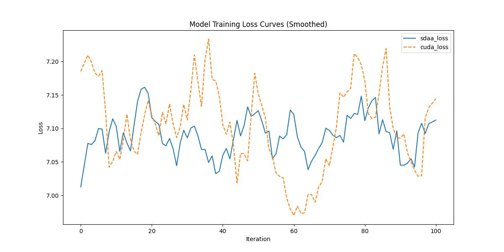

# **ConvNet**
## 1. 模型概述  
本工作由 Facebook AI Research (FAIR) 等人提出，目标是探索现代化卷积网络 (ConvNet) 的设计空间，以验证“纯 ConvNet”是否仍能与视觉 Transformer (Vision Transformer)／混合模型竞争 —— 进而发展出名为 ConvNeXt 的模型。论文主张：通过吸收近年来视觉 Transformer 社区流行的一些设计与训练技巧，对传统 ConvNet（例如 ResNet）进行系统“现代化 (modernization)”改造，就可以获得在分类与下游任务上，与 Transformer 相当甚至优于它们的性能，同时保持卷积网络设计的简单性和高效率。
> **论文链接**：https://arxiv.org/abs/2201.03545
> **仓库链接**：https://github.com/huggingface/pytorch-image-models  

## 2. 快速开始  
使用本模型执行训练的主要流程如下：  
1. 基础环境安装：介绍训练前需要完成的基础环境检查和安装。  
2. 获取数据集：介绍如何获取训练所需的数据集。  
3. 构建环境：介绍如何构建模型运行所需要的环境。  
4. 启动训练：介绍如何运行训练。  

### 2.1 基础环境安装  

请参考基础环境安装章节，完成训练前的基础环境检查和安装。  

### 2.2 准备数据集  

### Step 1: Dataset Preparation

#### 2.2.1 获取数据集
ImageNet 数据集，该数据集为开源数据集，可从 [ImageNet](https://image-net.org/) 下载。

#### 2.2.2 处理数据集
具体配置方式可参考：https://blog.csdn.net/xzxg001/article/details/142465729。

### 2.3 构建环境

所使用的环境下已经包含PyTorch框架虚拟环境  
1. 执行以下命令，启动虚拟环境。  
    ```
    conda activate torch_env  
    ```
2. 安装python依赖  
    ```
    cd <ModelZoo_path>/PyTorch/contrib/pytorch_image_model/convnext/
    pip install -r requirements.txt
    pip install -e .
    ```
### 2.4 启动训练  
1. 在构建好的环境中，进入训练脚本所在目录。  
    ```
    cd <ModelZoo_path>/PyTorch/contrib/pytorch_image_model/convnext/run_scripts
    ```

2. 运行训练。该模型支持单机单卡。

    -  单机单卡
    ```
    python run_convnext.py \
    --data-dir /data/teco-data/imagenet \
    --model convnext_base \
    --sched cosine \
    --epochs 1 \
    --warmup-epochs 5 \
    --lr 0.4 \
    --reprob 0.5 \
    --remode pixel \
    --batch-size 16 \
    --amp \
    -j 4 \
    --log-interval 1 \
    2>&1 | tee sdaa.log
   ```
    更多训练参数参考[README](run_scripts/README.md)

### 2.5 训练结果
输出训练loss曲线及结果（参考使用[loss.py](./run_scripts/loss.py)）: 


MeanRelativeError: -0.0015022143663049286
MeanAbsoluteError: -0.013709847289736909
Rule,mean_absolute_error -0.013709847289736909
pass mean_relative_error=-0.0015022143663049286 <= 0.05 or mean_absolute_error=-0.013709847289736909 <= 0.0002
