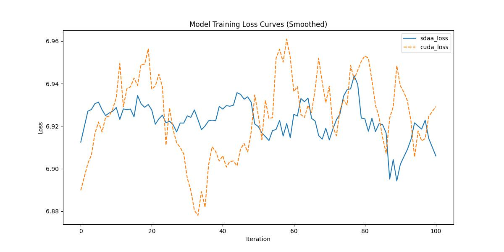

# **FBNetV3**
## 1. 模型概述  
FBNetV3: Joint Architecture-Recipe Search using Predictor Pretraining 是 Xiaoliang Dai 等人于 2020 年提出的一种 神经架构搜索（Neural Architecture Search, NAS）方法，旨在同时搜索神经网络结构（architecture）与训练配方（training recipe），从而得到 高效且高性能的视觉模型（即 FBNetV3 家族）。传统的 NAS 通常只在固定的训练超参数（learning rate、optimizer、augmentation 等）下搜索结构，而 FBNetV3 提出了联合搜索“架构 + 训练配方”的框架（称为 Neural Architecture-Recipe Search, NARS），使得搜索出的模型在目标精度与资源约束下的表现更佳。FBNetV3 系列模型在 ImageNet 分类与下游检测任务上实现了比当时自动设计与手工设计的模型更优的效率／精度 trade-off。
> **论文链接**：https://arxiv.org/abs/2006.02049
> **仓库链接**：https://github.com/huggingface/pytorch-image-models  

## 2. 快速开始  
使用本模型执行训练的主要流程如下：  
1. 基础环境安装：介绍训练前需要完成的基础环境检查和安装。  
2. 获取数据集：介绍如何获取训练所需的数据集。  
3. 构建环境：介绍如何构建模型运行所需要的环境。  
4. 启动训练：介绍如何运行训练。  

### 2.1 基础环境安装  

请参考基础环境安装章节，完成训练前的基础环境检查和安装。  

### 2.2 准备数据集  

### Step 1: Dataset Preparation

#### 2.2.1 获取数据集
ImageNet 数据集，该数据集为开源数据集，可从 [ImageNet](https://image-net.org/) 下载。

#### 2.2.2 处理数据集
具体配置方式可参考：https://blog.csdn.net/xzxg001/article/details/142465729。

### 2.3 构建环境

所使用的环境下已经包含PyTorch框架虚拟环境  
1. 执行以下命令，启动虚拟环境。  
    ```
    conda activate torch_env  
    ```
2. 安装python依赖  
    ```
    cd <ModelZoo_path>/PyTorch/contrib/pytorch_image_model/fbnetv3/
    pip install -r requirements.txt
    pip install -e .
    ```
### 2.4 启动训练  
1. 在构建好的环境中，进入训练脚本所在目录。  
    ```
    cd <ModelZoo_path>/PyTorch/contrib/pytorch_image_model/fbnetv3/run_scripts
    ```

2. 运行训练。该模型支持单机单卡。

    -  单机单卡
    ```
    python run_fbnetv3.py \
    --data-dir /data/teco-data/imagenet \
    --model fbnetv3_b \
    --sched cosine \
    --epochs 1 \
    --warmup-epochs 5 \
    --lr 0.4 \
    --reprob 0.5 \
    --remode pixel \
    --batch-size 16 \
    --amp \
    -j 4 \
    --log-interval 1 \
    2>&1 | tee sdaa.log
   ```
    更多训练参数参考[README](run_scripts/README.md)

### 2.5 训练结果
输出训练loss曲线及结果（参考使用[loss.py](./run_scripts/loss.py)）: 


MeanRelativeError: -0.0002511486091050863
MeanAbsoluteError: -0.0019490553600953358
Rule,mean_absolute_error -0.0019490553600953358
pass mean_relative_error=-0.0002511486091050863 <= 0.05 or mean_absolute_error=-0.0019490553600953358 <= 0.0002
