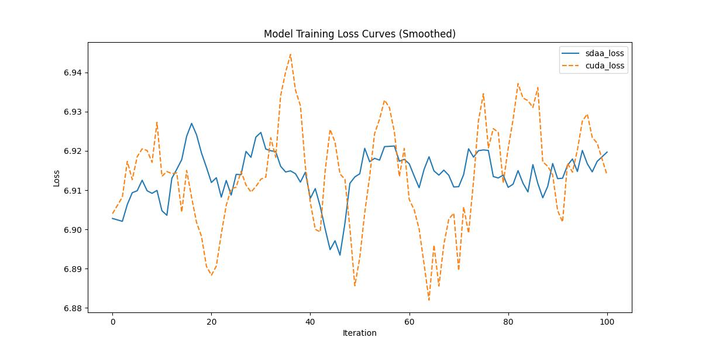

# **HardCoRe-NAS**
## 1. 模型概述  
HardCoRe-NAS: Hard Constrained diffeRentiable Neural Architecture Search 是 Niv Nayman、Yonathan Aflalo、Asaf Noy 和 Lihi Zelnik-Manor 等人于 2021 年提出的一种 硬约束可微分神经架构搜索 (Neural Architecture Search, NAS) 方法，旨在解决传统 NAS 在实际部署中常见的资源约束（如延迟、能耗、内存）难以严格满足的问题。不同于多数 NAS 方法仅施加“软约束”惩罚，而这些软约束往往不能确保搜索出的架构在真实目标硬件上满足资源指标，HardCoRe-NAS 提出了一套可微且可扩展的搜索框架，使得目标资源约束在整个搜索过程中都能被严格满足，从而得到在精度与资源条件下更可靠的架构。
> **论文链接**：https://arxiv.org/abs/2102.11646
> **仓库链接**：https://github.com/huggingface/pytorch-image-models  

## 2. 快速开始  
使用本模型执行训练的主要流程如下：  
1. 基础环境安装：介绍训练前需要完成的基础环境检查和安装。  
2. 获取数据集：介绍如何获取训练所需的数据集。  
3. 构建环境：介绍如何构建模型运行所需要的环境。  
4. 启动训练：介绍如何运行训练。  

### 2.1 基础环境安装  

请参考基础环境安装章节，完成训练前的基础环境检查和安装。  

### 2.2 准备数据集  

### Step 1: Dataset Preparation

#### 2.2.1 获取数据集
ImageNet 数据集，该数据集为开源数据集，可从 [ImageNet](https://image-net.org/) 下载。

#### 2.2.2 处理数据集
具体配置方式可参考：https://blog.csdn.net/xzxg001/article/details/142465729。

### 2.3 构建环境

所使用的环境下已经包含PyTorch框架虚拟环境  
1. 执行以下命令，启动虚拟环境。  
    ```
    conda activate torch_env  
    ```
2. 安装python依赖  
    ```
    cd <ModelZoo_path>/PyTorch/contrib/pytorch_image_model/hardcorenas/
    pip install -r requirements.txt
    pip install -e .
    ```
### 2.4 启动训练  
1. 在构建好的环境中，进入训练脚本所在目录。  
    ```
    cd <ModelZoo_path>/PyTorch/contrib/pytorch_image_model/hardcorenas/run_scripts
    ```

2. 运行训练。该模型支持单机单卡。

    -  单机单卡
    ```
    python run_hardcorenas.py \
    --data-dir /data/teco-data/imagenet \
    --model hardcorenas_a \
    --sched cosine \
    --epochs 1 \
    --warmup-epochs 5 \
    --lr 0.4 \
    --reprob 0.5 \
    --remode pixel \
    --batch-size 16 \
    --amp \
    -j 4 \
    --log-interval 1 \
    2>&1 | tee sdaa.log
   ```
    更多训练参数参考[README](run_scripts/README.md)

### 2.5 训练结果
输出训练loss曲线及结果（参考使用[loss.py](./run_scripts/loss.py)）: 


MeanRelativeError: -6.311799147650429e-06
MeanAbsoluteError: -0.00014478381317440826
Rule,mean_absolute_error -0.00014478381317440826
pass mean_relative_error=-6.311799147650429e-06 <= 0.05 or mean_absolute_error=-0.00014478381317440826 <= 0.0002
