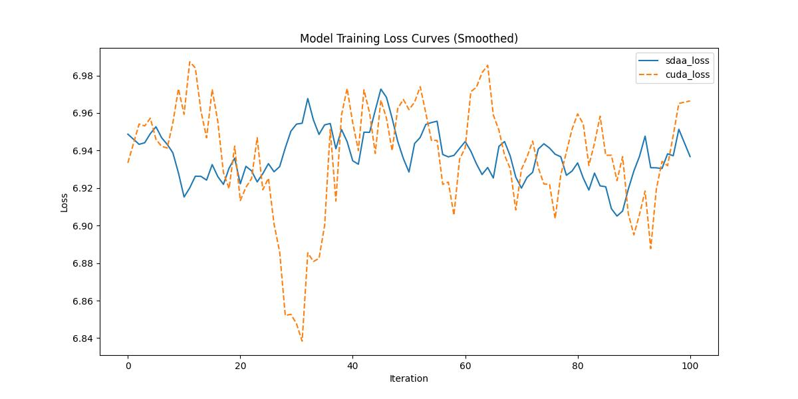

# **Inception-v2**
## 1. 模型概述  
Inception-v2, Inception-ResNet and the Impact of Residual Connections on Learning 是由 Christian Szegedy, Sergey Ioffe, Vincent Vanhoucke, Alex Alemi 等人于 2016 年提出的一篇工作，其核心目标在于 探讨 Inception 架构与残差连接 (Residual Connections) 的结合 以及这种组合对深度卷积网络训练与性能的影响。该论文基于 Google 的 Inception 系列网络（如 Inception-v3）进行了扩展，通过引入残差结构（类似于 ResNet 的 shortcut 连接）来提升 Inception 网络的训练速度、稳定性和最终的分类性能，并给出了一系列改进的 Inception 及 Inception-ResNet 网络设计。
> **论文链接**：https://arxiv.org/abs/1602.07261
> **仓库链接**：https://github.com/huggingface/pytorch-image-models  

## 2. 快速开始  
使用本模型执行训练的主要流程如下：  
1. 基础环境安装：介绍训练前需要完成的基础环境检查和安装。  
2. 获取数据集：介绍如何获取训练所需的数据集。  
3. 构建环境：介绍如何构建模型运行所需要的环境。  
4. 启动训练：介绍如何运行训练。  

### 2.1 基础环境安装  

请参考基础环境安装章节，完成训练前的基础环境检查和安装。  

### 2.2 准备数据集  

### Step 1: Dataset Preparation

#### 2.2.1 获取数据集
ImageNet 数据集，该数据集为开源数据集，可从 [ImageNet](https://image-net.org/) 下载。

#### 2.2.2 处理数据集
具体配置方式可参考：https://blog.csdn.net/xzxg001/article/details/142465729。

### 2.3 构建环境

所使用的环境下已经包含PyTorch框架虚拟环境  
1. 执行以下命令，启动虚拟环境。  
    ```
    conda activate torch_env  
    ```
2. 安装python依赖  
    ```
    cd <ModelZoo_path>/PyTorch/contrib/pytorch_image_model/inception_v2/
    pip install -r requirements.txt
    pip install -e .
    ```
### 2.4 启动训练  
1. 在构建好的环境中，进入训练脚本所在目录。  
    ```
    cd <ModelZoo_path>/PyTorch/contrib/pytorch_image_model/inception_v2/run_scripts
    ```

2. 运行训练。该模型支持单机单卡。

    -  单机单卡
    ```
    python run_inception_v2.py \
    --data-dir /data/teco-data/imagenet \
    --model inception_resnet_v2 \
    --sched cosine \
    --epochs 1 \
    --warmup-epochs 5 \
    --lr 0.4 \
    --reprob 0.5 \
    --remode pixel \
    --batch-size 16 \
    --amp \
    -j 4 \
    --log-interval 1 \
    2>&1 | tee sdaa.log
   ```
    更多训练参数参考[README](run_scripts/README.md)

### 2.5 训练结果
输出训练loss曲线及结果（参考使用[loss.py](./run_scripts/loss.py)）: 


MeanRelativeError: 0.00017803875332139825
MeanAbsoluteError: 0.0006498487869111618
Rule,mean_relative_error 0.00017803875332139825
pass mean_relative_error=0.00017803875332139825 <= 0.05 or mean_absolute_error=0.0006498487869111618 <= 0.0002
