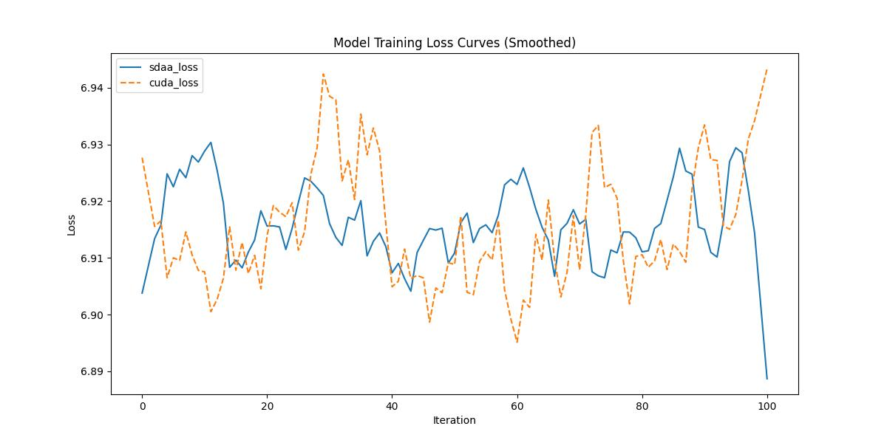

# **RegNet**
## 1. 模型概述  
Designing Network Design Spaces 由 Ilija Radosavovic、Raj Prateek Kosaraju、Ross Girshick、Kaiming He 和 Piotr Dollár 等人于 2020 年提出，提出了一种新的 网络设计范式 (network design space)——不是设计单个具体的神经网络结构，而是设计一个参数化的“网络设计空间”，从整体上理解和掌握优质网络架构的规律。基于这一理念，作者构建了一类称为 RegNet（Regular Network） 的简单、规则网络设计空间，通过对网络宽度与深度的参数化分析，发现其线性 + 量化的规律能覆盖高效且高性能的网络。该设计空间所得到的网络在多种 FLOP 预算下都表现优秀，并在相同训练条件下 surpass 了诸如 EfficientNet 这样的当时流行架构，同时推理速度更快（在 GPU 上快 ~5×）。
> **论文链接**：https://arxiv.org/abs/2003.13678
> **仓库链接**：https://github.com/huggingface/pytorch-image-models  

## 2. 快速开始  
使用本模型执行训练的主要流程如下：  
1. 基础环境安装：介绍训练前需要完成的基础环境检查和安装。  
2. 获取数据集：介绍如何获取训练所需的数据集。  
3. 构建环境：介绍如何构建模型运行所需要的环境。  
4. 启动训练：介绍如何运行训练。  

### 2.1 基础环境安装  

请参考基础环境安装章节，完成训练前的基础环境检查和安装。  

### 2.2 准备数据集  

### Step 1: Dataset Preparation

#### 2.2.1 获取数据集
ImageNet 数据集，该数据集为开源数据集，可从 [ImageNet](https://image-net.org/) 下载。

#### 2.2.2 处理数据集
具体配置方式可参考：https://blog.csdn.net/xzxg001/article/details/142465729。

### 2.3 构建环境

所使用的环境下已经包含PyTorch框架虚拟环境  
1. 执行以下命令，启动虚拟环境。  
    ```
    conda activate torch_env  
    ```
2. 安装python依赖  
    ```
    cd <ModelZoo_path>/PyTorch/contrib/pytorch_image_model/regnet/
    pip install -r requirements.txt
    pip install -e .
    ```
### 2.4 启动训练  
1. 在构建好的环境中，进入训练脚本所在目录。  
    ```
    cd <ModelZoo_path>/PyTorch/contrib/pytorch_image_model/regnet/run_scripts
    ```

2. 运行训练。该模型支持单机单卡。

    -  单机单卡
    ```
    python run_regnet.py \
    --data-dir /data/teco-data/imagenet \
    --model regnetv_040 \
    --sched cosine \
    --epochs 1 \
    --warmup-epochs 5 \
    --lr 0.4 \
    --reprob 0.5 \
    --remode pixel \
    --batch-size 16 \
    --amp \
    -j 4 \
    --log-interval 1 \
    2>&1 | tee sdaa.log
   ```
    更多训练参数参考[README](run_scripts/README.md)

### 2.5 训练结果
输出训练loss曲线及结果（参考使用[loss.py](./run_scripts/loss.py)）: 


MeanRelativeError: 0.00014189545706013693
MeanAbsoluteError: 0.000883295984551458
Rule,mean_relative_error 0.00014189545706013693
pass mean_relative_error=0.00014189545706013693 <= 0.05 or mean_absolute_error=0.000883295984551458 <= 0.0002
